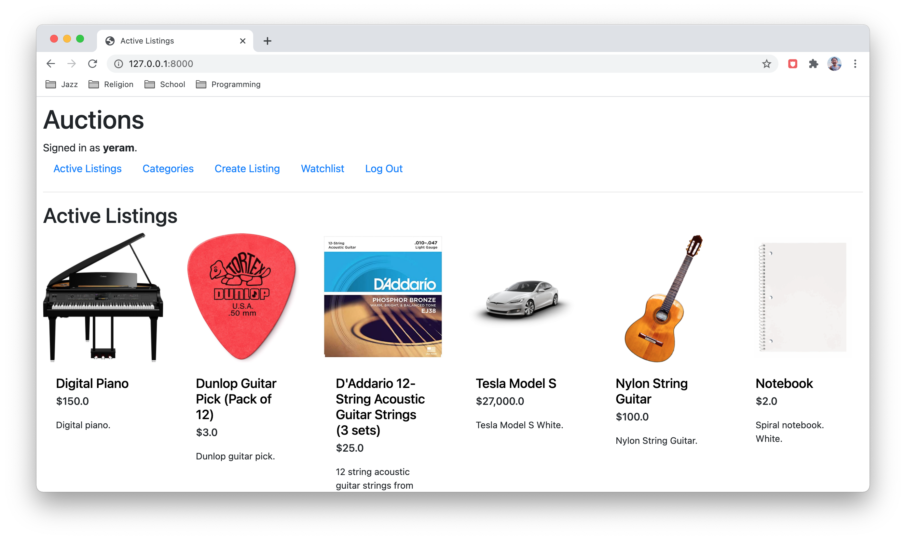
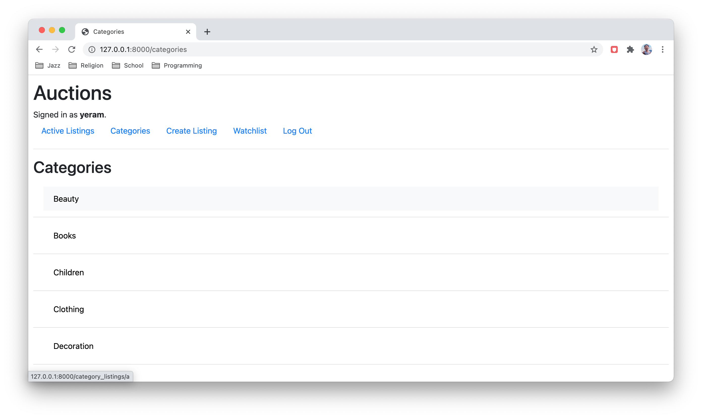
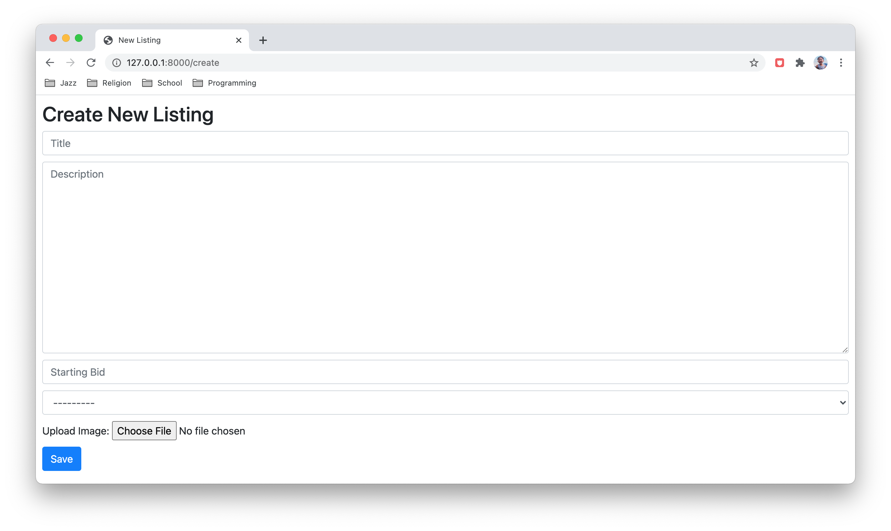
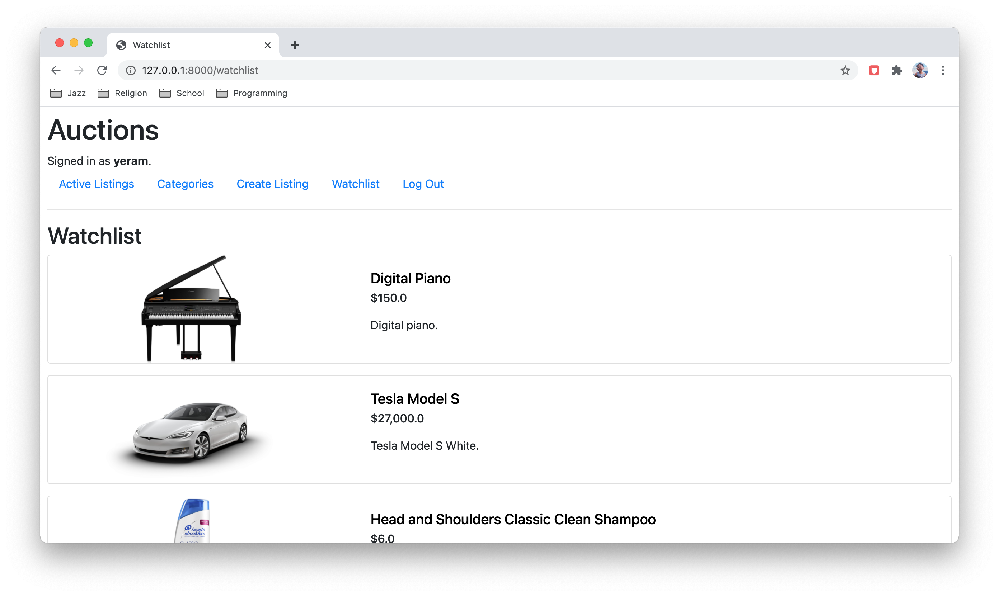
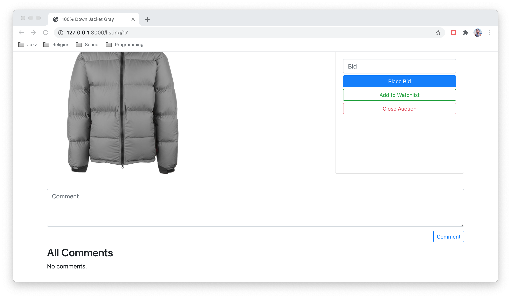
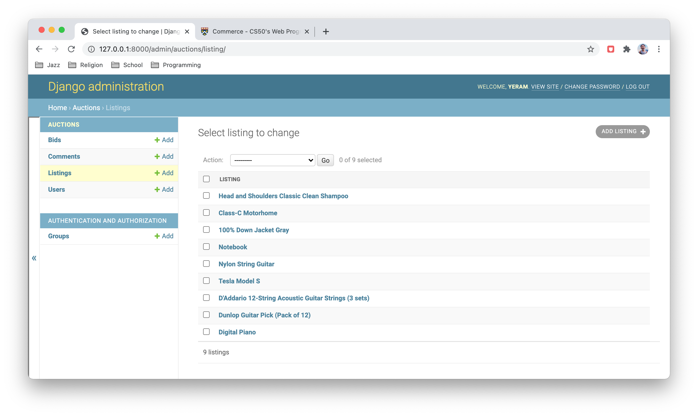

# Auction App









## Description
This project uses HTML, CSS, Django + Django models to create an online commerce app where users are able to create, view, comment, and bid on auction listings. It follows all the specifications of [CS50W's Commerce](https://cs50.harvard.edu/web/2020/projects/2/commerce/) project, plus additional customization.

- Users are able to create an account, sign in, and start bidding on active listings or create their own. Sellers are also able to close auctions, thereby displaying the highest bidder as the winner and rendering the listing as inactive.

- When creating an entry, users can upload a photo image and select a category to choose from.

- Users should be able to add or remove items to their watchlist. 

- Users can also leave comments on all active listings.

- If any creation/submission criteria is not sufficiently met, error messages will be displayed, e.g. a bid that is lower than the current price results in an error.

- A site administrator should be able to view, edit, and delete any users, comments, and items.

## Requirements
This project utilizes the [Django](https://www.djangoproject.com/download/) framework.

It also utlizes the [django_cleanup](https://pypi.org/project/django-cleanup/) package to remove image files from the media directory when a listing object is deleted via the Django admin portal. 

```
pip install django-cleanup
```

## Running
To run this application, change into the outer commerce directory and run the following command from the terminal:

```
$ python manage.py runserver
```

Once the Django development server runs, visit the server's address to open the app.

### Admin
To use the admin interface, you must create a superuser account by changing into the outer commerce directory and running the following command from the terminal:

```
$ python manage.py createsuperuser
```

